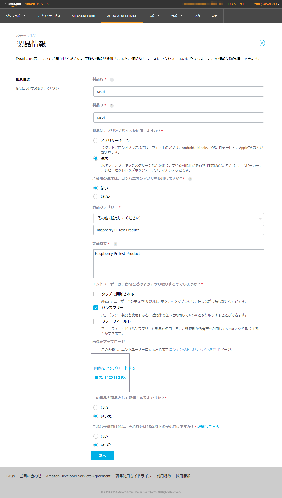
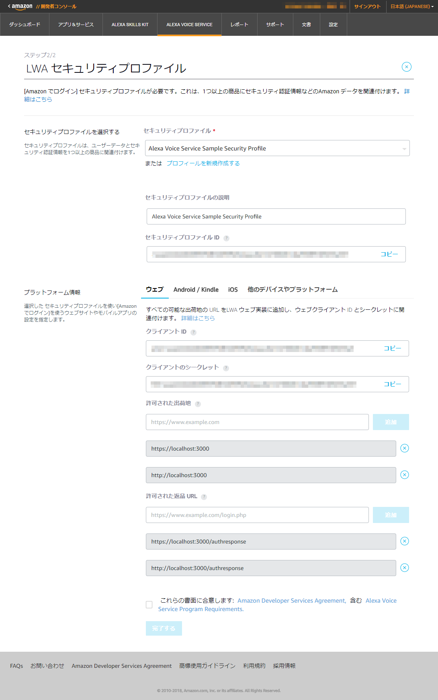
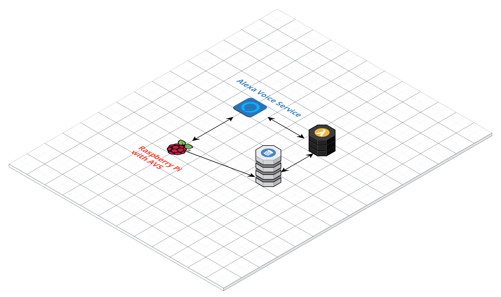
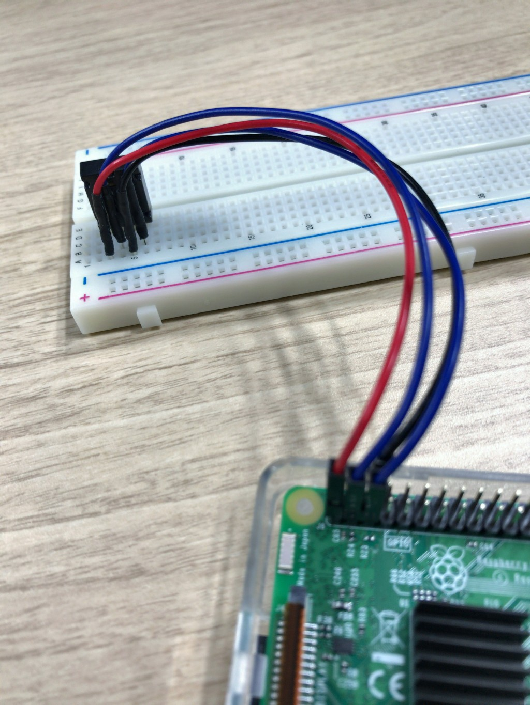
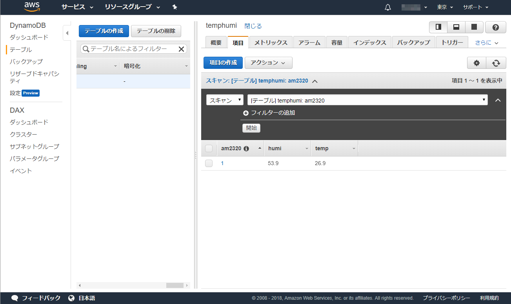
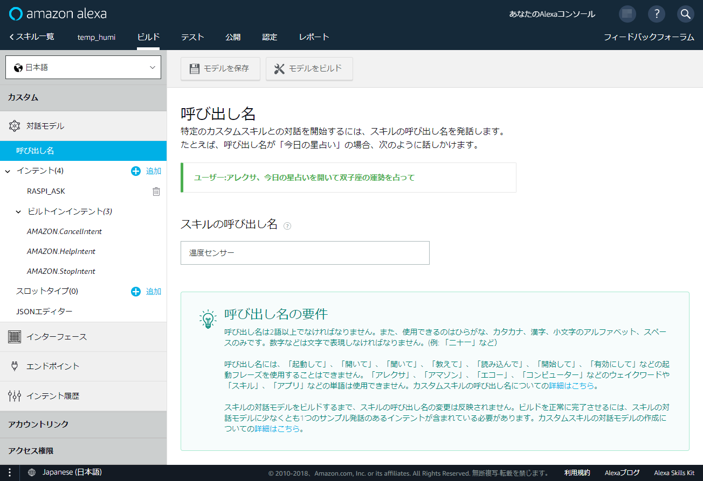
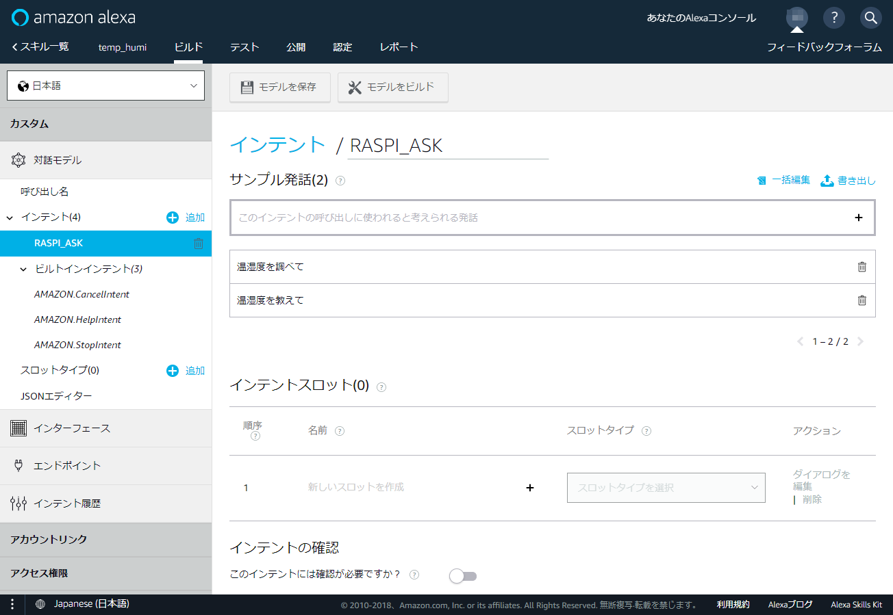
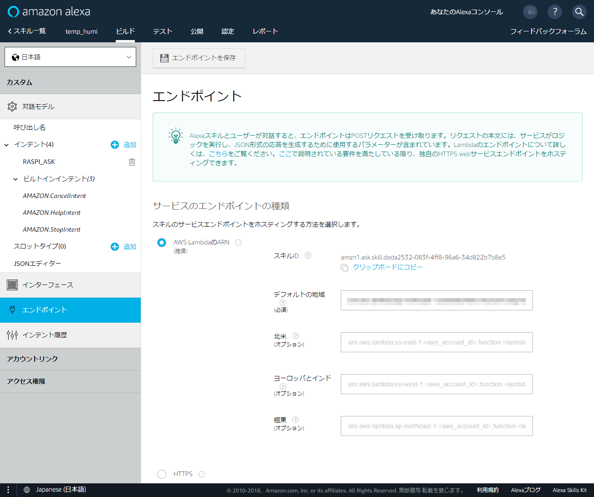
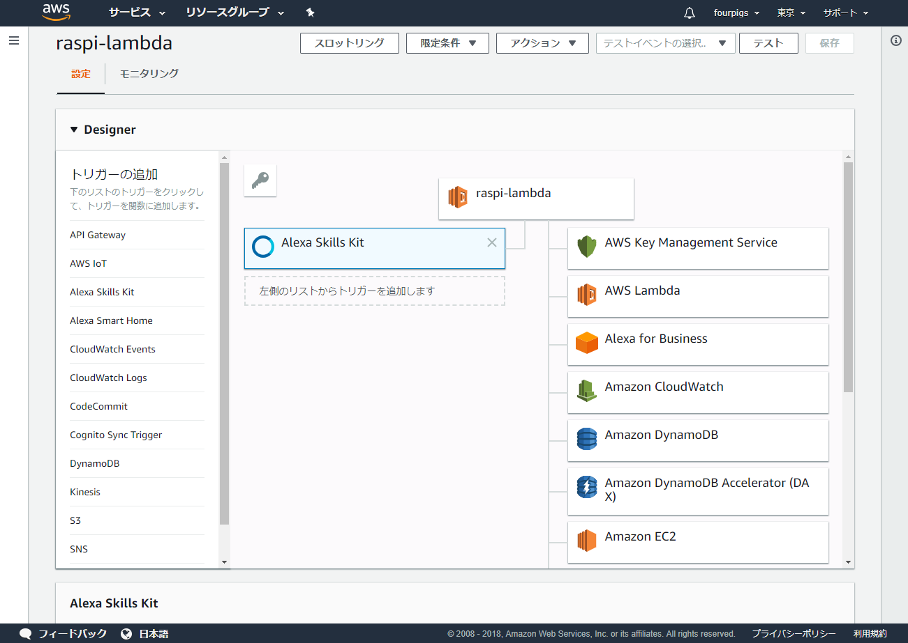
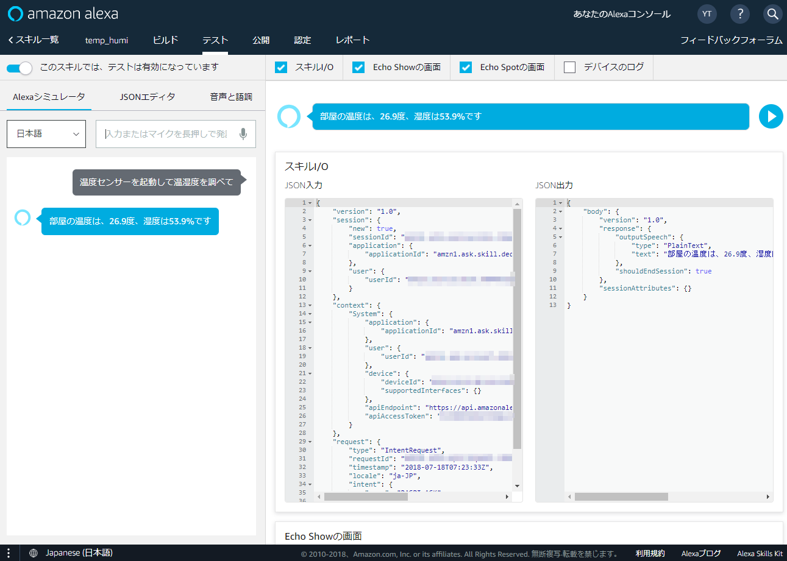

# RaspiでAlexa Voice Serviceを使ってみる

## ゴール
1. Alexa Voice Service サンプルプロジェクトを利用し、RaspiでAVSを試してみる
1. Raspiに温湿度センサー(AM2320)を接続し、温度、湿度を聞けるSkillを作る。

### Alexa Voice Service サンプルプロジェクトとは
AVSを利用したプロトタイプをStep By Stepで作成することができるJavaベースのプロダクト。2018年1月よりメンテナンスモードに入っており、C++ベースのAVS Device SDKを利用するよう、ガイドされている。
https://github.com/alexa/alexa-avs-sample-app

|アプリケーション|内容|
|--|--|
|companionService|認証用Webサービス|
|javaclient|AVSとやり取りするメインのjavaGUIアプリ|
|wakeWordAgent|アレクサ！という起動ワードを受け付けてjavaclientを待ち受けモードにするエージェント|

## 用意するもの
- Raspberry Pi 3 Type B
- マイク、アクティブスピーカー
- ブレッドボード、温湿度センサモジュール（AM2320）、ジャンパー線（オス-メス）

AM2320についてはこちら。  
http://akizukidenshi.com/catalog/g/gM-08663/  

# RaspiでAVSサンプルプロジェクトを動かす
## ステップ
1. Amazon開発者アカウントの登録（JP）
1. AVSで製品を登録
1. AVSサンプルプロジェクトのダウンロードとインストール、起動
1. 動作確認。Let's Alexa!

ここでは製品の登録～動作確認までおさらい。

## 製品の登録


## セキュリティプロファイルの作成




## サンプロプロジェクトのダウンロードとインストール

事前にJava8をインストールしておく  
```sh
$ sudo apt install -y oracle-java8-jdk git
```

サンプルプロジェクトの取得
```sh
$ mkdir alexa
$ cd alexa
$ git clone https://github.com/alexa/alexa-avs-sample-app.git
```

ProductID、ClientID、Secretおよびロケール情報をinstallシェルに設定

automated_install.sh
```sh
ProductID='xxxxxx'
ClientID='amzn.xxxxx.xxxxxxxxx'
ClientSecret='xxxxxxxxxxxxxxxxxxxxxxxxxxxxxxxxxxxxxxxxx'
Country='JP'
State='TOKYO'
City='TOKYO'
```

インストーラの実行
```sh
$ chmod 755 automated_install.sh
$ ./automated_install.sh
```
もろもろ質問に答えて完了。

## 起動

前述のとおり、AVSサンプルプロジェクトは大きく3つのアプリケーションから構成されます。

- companionService
- javaclient
- wakeWordAgent

Raspberry PiのGUI上でターミナルを3つ起動し、それぞれ、起動していきます。

companionService
```sh
$ cd ~/alexa/alexa-avs-sample-app/samples/companionService
$ npm start
```

javaclient
```sh
$ cd ~/alexa/alexa-avs-sample-app/samples/javaclient
$ mvn exec:exec
```

wakeWordAgent
```sh
$ cd ~/alexa/alexa-avs-sample-app/samples/wakeWordAgent/src
$ wakeWordAgent -e sensory
```

なお、Wake Word Agentで使用するサービスには種類があり、推奨は「Sensory」ですが、  
180日の期間限定らしいので、長期間使用する場合は「KITT_AI」を使用するように、とのこと。

KITT_AIを使用する場合は
```sh
$ wakeWordAgent -e kitt_ai
```
とする。

## 動作確認
これで準備完了。
あらかじめRapberry Piに接続したマイクに向かって「アレクサ！」と声をかけてみます。
「ポン!」と音がするので、いろいろ聞いてみましょう。

# 独自スキルの開発
AVSサンプルだけだと面白くないし、せっかくラズパイを使っているので、温湿度センサーを使って部屋の温度、湿度をAlexaに答えてもらいます。
ラズパイマガジン（18年6月号）に載っていたもの参考に、AM2320向けにカスタマイズした感じです。

## 温湿度応答システムの仕組み

- 温湿度センサーから読み取った値をAWSのDynamoDBに一定間隔で書き込む（最新1件のみ）
- LambdaにDynamoDBから値を取り出すFunctionを登録
- Alexa Skill にLambdaに登録済みの関数を呼び出す新規スキルを登録

これで、特定のキーワードでAVSに問い合わせをすると、Lambdaの関数が実行され、DynamoDBに保存された温度、湿度を返答してくれるようになります。



ポイント

- DynamoDBへの書き込みは、Pythonのライブラリであるboto3を利用する
- Lambdaでサポートされるpythonは3.6以上。ラズパイに入っているものは3.5なのでバージョンアップ必要。

|プログラム|説明|
|-|-|
|humi_temp_am2320_to_dynamo.py|ラズパイ上で温湿度を読み取り、AWSのDynamoDBに最新の温湿度を書き込むプログラム|
|lambda_ask.py|Lambdaに登録する関数。DyanmoDBからのデータ取得と、Alexa Skillから呼び出された際の応答（JSON形式）をおこなう|

## 温湿度をDynamoDBに書き込む

### AWSアカウントの作成
詳細は割愛。  
クレジットカード情報が必要になります。今回はすべて無料枠でできる範囲です。

### IAMでDynamoDBへアクセスするためのユーザを作成

|||
|--|--|
|ユーザ名|raspi(お好きなもので)|
|ユーザの種類|プログラムからアクセス|
|権限|DynamoDBFullAccess<br/>AlexaVoiceServiceFullAccess|


### ライブラリの導入
PythonでDynamoDBにアクセスするためのライブラリ、boto3および、AWSのアクセスキーを設定するためのコマンドインターフェイス、awscliをインストールします。

```sh
$ pip3 install boto3
$ pip install awscli --upgrade --user
```
pip,pip3がない場合はapt installで導入しましょう。

awscliは--userオプション導入で、piユーザのホームディレクトリ配下の.local/binに導入されます。

まず、aws configureで事前に作成したIAMユーザ（raspi）のアクセスキー、シークレットと、リージョン（ap-northeast-1）、デフォルトの出力形式（JSON）を指定します。

```sh
$ ~/.local/bin/aws configure
```

### 配線

ブレッドボードにセンサーをセットし、ジャンパー線でラズパイ本体と接続します。

GPIOのNo.1から3.3Vの電源をとり、マイナス端子はNo.6のGND（他、GNDであればどこでも可）に接続します。  
No.3（GPIO02）にデータ読み取り（SDA)端子、No.5（GPIO03）に同期（SCL）の端子を接続します。

出典：http://www.raspberrypi-spy.co.uk/2012/06/simple-guide-to-the-rpi-gpio-header-and-pins/



### センサーの動作確認

センサーから取得した値をprintする単純なプログラムで動作確認してみます。  

I2Cで温度センサーの情報を読み取る方法についてはググればいろいろ出てきます。  
[温湿度センサAM2320をRaspberry Pi 3で使用する](http://wizqro.net/%E6%B8%A9%E6%B9%BF%E5%BA%A6%E3%82%BB%E3%83%B3%E3%82%B5am2320%E3%82%92raspberry-pi-3%E3%81%A7%E4%BD%BF%E7%94%A8%E3%81%99%E3%82%8B/)


[check_am2320.py](src/check_am2320.py)

### DynamoDBへの書き込みプログラム

DynamoDB上にテーブルがなければ作成、あればセンサーから読み取った情報をDynamaDBに上書き更新するプログラムを実装します。

[humi_temp_am2320_to_dynamo.py](src/humi_temp_am2320_to_dynamo.py)

注：floatはそのままDynamoDBに登録できないため、Decimal変換するが、Decimal(__float value__)はうまくいかないので、Decimal(str(__float_value__))とする。

実行結果
```sh
$ python3 humi_temp_am2320_to_dynamo.py
$ Temperature: 26.9 C Humidity: 54.3 %
$ Temperature: 27.0 C Humidity: 54.8 %
$ Temperature: 27.0 C Humidity: 55.2 %
```



## Alexa SkillとLambda関数の作成

AVSでは独自のスキルを作成し、実行することができます。
特定のフレーズ（言葉）でスキルを呼び出し、スキルに紐づけられた外部サービスを実行、結果をAlexaの発言(?)として取得することが可能です。

スキルから呼び出すことができるサービスはLambda関数、またはHTTPですが、Lambdaが推奨されています。

AVS向けのLambda関数を手軽に作る[EchoKit](https://github.com/arcward/echokit)というSDKがあるので、それを利用します。

### Alexa Skillの作成
[Alexa開発者ポータル](https://developer.amazon.com/ja/alex)から、ASK（Alexa Skills Kit）を選択し、「スキルの作成」を行います。

スキル作成時には以下の情報の入力が必要です。

|設定項目|設定内容|説明|
|---|---|---|
|呼び出し名|温度センサー|カスタムスキルを起動するためのキーワード|
|インテント|温湿度を調べて<br/>温湿度を教えて|スキルを実行するためのフレーズ|
|エンドポイント|AWS Lambda関数のARN（詳細は後述）|スキル実行時に呼び出すLambda関数のARN（Amazon Resource Name）|

呼び出し名



インテント



エンドポイント



初回作成時点ではLambdaのARNが決まっていないので、スキルIDをコピーし、Lambda関数の作成後、設定します。

### Lambda関数の作成

EchoKitをダウンロードし、インストールします。
```sh
$ git clone https://github.com/arcward/echokit
$ cd ~/echokit
$ sudo python3.6 setup.py install
```

Lambda上で実行するプログラムを実装します。（~/lambda_devに配置）

ask_temphumi.py
```python
import os
from echokit import EchoKit
import boto3
from boto3.session import Session
from boto3.dynamodb.conditions import Key, Attr

app = EchoKit("amzn1.ask.skill.xxxxxxxx-xxxx-xxxx-xxxx-xxxxxxxxxxxx")
handler = app.handler

@app.launch
def on_launch(request, session):
    return app.response("部屋の温湿度を調べるには、つづけて温湿度を訪ねてください")

@app.intent("RASPI_ASK")
def on_intent(request, session):
    data = get_data()
    return app.response("部屋の温度は、{}度、湿度は{}%です".format(data['temp'],data['humi']))

def get_data():
    db = boto3.resource('dynamodb')
    table = db.Table('temphumi')
    dht = table.get_item(Key = {'am2320' : 1})['Item']
    return dht
```
インテントに対応した処理を手軽に実装することが可能です。

echokitに含まれるechozipでアーカイブを作成
```sh
$ cd ~/lambda_dev
$ echozip .
```

### Lambda関数の登録

以下のステップでLambda関数を登録する。
- Lambdaが使用するロールの作成
- プログラムのアップロード
- Lambda関数へのスキルIDの設定

AWSマネジメントコンソールで、Lambdaのアクセス権限で、ロール「raspi-lambda-role」を作成します。  
付与する権限は「AlexaForBusinessFullAccess」、「AmazonsDynamoDBFullAccess」。  

Lambdaダッシュボードで関数を作成する。

|項目|設定値|
|---|---|
|名前|raspi-lambda|
|ランタイム|Python 3.6|
|ロール|既存のロールを選択で「raspi-lambda-role」を選択|

これで作成するとARNが表示されるので、ASKに戻り、エンドポイントのARNを設定。

再度Lambda設定画面に戻り、Desinerメニューで「Alexa Skill Kit」をクリックし、トリガーを作成する。この際、AKS側で生成されたスキルIDを設定します。



デザイナ上でraspi-lambda関数をクリックし、事前に作成したアーカイブをアップロードし、ハンドラを「ask_temphumi.handler」とします。  
また、EchoKitコンストラクタをインラインで編集し、正しいスキルIDを設定します。

以上でLambda関数の登録と、Alexaスキルとの関連付けは終了です。
ASKのテスト画面で、テストしてみましょう。



うまくテストできました！

このままではスキルは一般公開されていないので使用できませんが、開発者アカウントと紐づく環境であれば実行できるはずなので、Raspiに接続したマイクでスキルを実行してみましょう。

おわり
